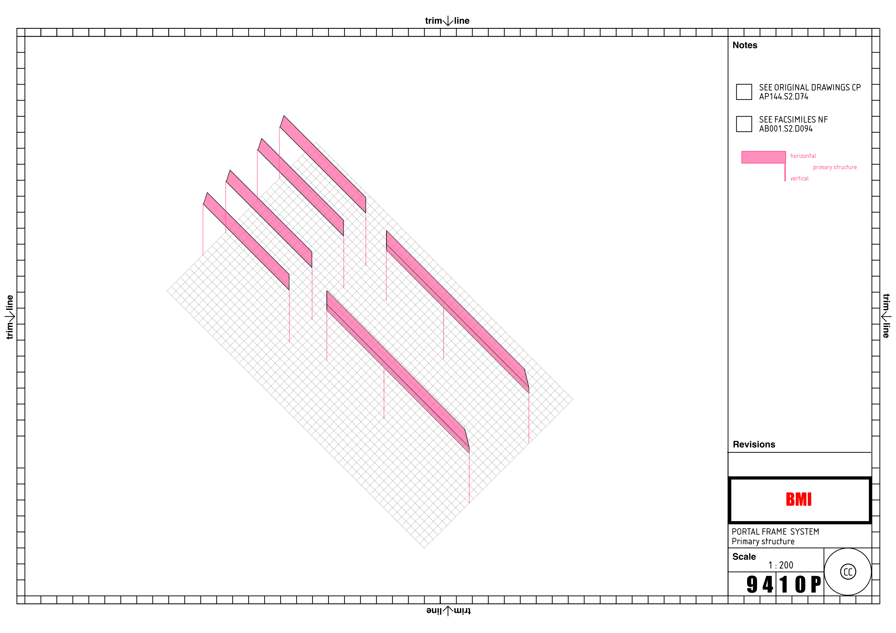

# cp-bmi-reconstruction

Live digital reconstruction and progressive SVG study of Cedric Price’s BMI drawings.

This repository records the ongoing production of research facsimiles, interpretive SVG drawings, and methodological reflections.

## Portal Frame Study — Primary Structure (v1)

Initial placeholder showing a reduced interpretation of the primary structural system.

